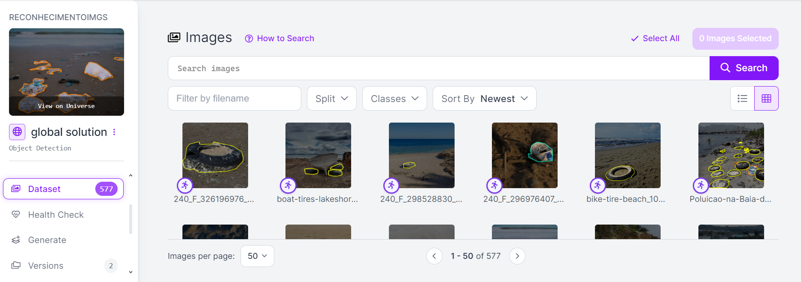
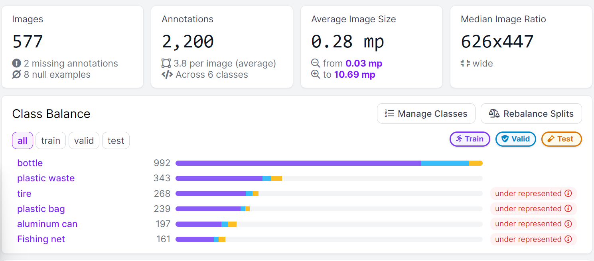
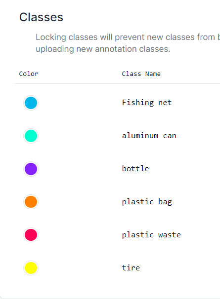
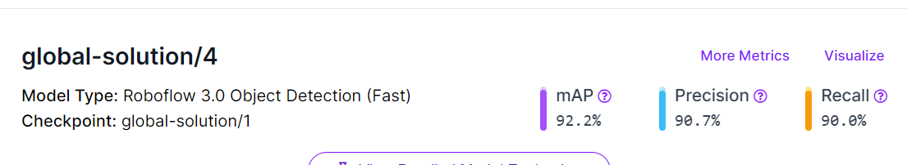
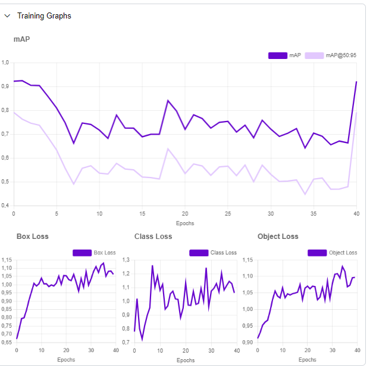
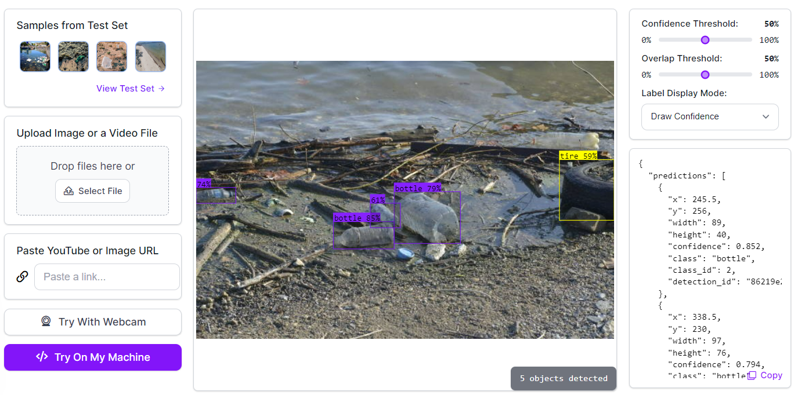

# Desafio Inovação Azul - Global Solution: Engajando Tecnologia para um Futuro Sustentável nos Oceanos

### Descrição do Problema

Os oceanos enfrentam desafios significativos, incluindo a destruição de habitats marinhos, poluição e mudanças climáticas. Esses problemas não apenas ameaçam os ecossistemas marinhos, mas também têm impactos diretos na economia global. O objetivo do Desafio Inovação Azul 2024 é encontrar soluções inovadoras e tecnológicas que promovam a gestão sustentável dos oceanos, garantindo que as atividades humanas sejam ecologicamente responsáveis, socialmente inclusivas e economicamente viáveis a longo prazo.

### Objetivo

O desafio busca desenvolver projetos que:
- Ajudem no monitoramento da saúde dos oceanos e na conservação de seus ecossistemas.
- Promovam inovações em energia renovável marinha.
- Criem soluções para reduzir, reciclar ou eliminar a poluição nos oceanos.
- Utilizem big data e inteligência artificial para melhorar a gestão e o planejamento dos recursos marinhos.

### Metodologia Utilizada

Para abordar o problema da poluição costeira e marinha, desenvolvemos uma solução que envolve a monitorização colaborativa e conscientização pública. Sendo o usuário poder tirar fotos de onde ele está e o sistema verificar o lixo das fotos.

#### Tecnologias Utilizadas

- **Roboflow**: Utilizado para o treinamento e implementação de modelos de detecção de objetos que identificam diferentes tipos de resíduos em imagens enviadas pelos usuários.
- **Big Data e Inteligência Artificial**: Implementados para a verificação e análise dos dados coletados, melhorando a gestão e o planejamento dos recursos marinhos.

### Resultados Obtidos

O modelo de detecção de objetos foi treinado utilizando o Roboflow 3.0 Object Detection (Fast), alcançando os seguintes resultados:
[Link do projeto no roboflow](https://universe.roboflow.com/reconhecimentoimgs/global-solution)

#### Dataset

#### Classes
 

#### Precisão

- **mAP (Mean Average Precision)**: 92.2%
- **Precision**: 90.7%
- **Recall**: 90.0%

#### Gráficos 

#### Teste
 

Esses resultados indicam que o modelo é eficaz na identificação precisa de resíduos em imagens. A plataforma desenvolvida permite a coleta e verificação de dados de maneira eficiente, proporcionando uma ferramenta poderosa para o monitoramento e redução da poluição marinha.

### Conclusões

A solução desenvolvida atende aos objetivos do Desafio Inovação Azul 2024 ao:

- **Engajar a Comunidade**: Envolver ativamente os cidadãos na coleta de dados e conscientização sobre a poluição marinha.
- **Utilizar Tecnologia Avançada**: Implementar inteligência artificial e big data para melhorar a precisão e eficiência na gestão dos dados coletados.
- **Promover Sustentabilidade**: Contribuir para a redução da poluição marinha e preservação dos ecossistemas, garantindo que as atividades humanas nos oceanos sejam sustentáveis a longo prazo.

Com a plataforma proposta, espera-se uma redução significativa na poluição costeira e marinha, ao mesmo tempo em que se promove a conscientização pública e a participação ativa na proteção do meio ambiente.
